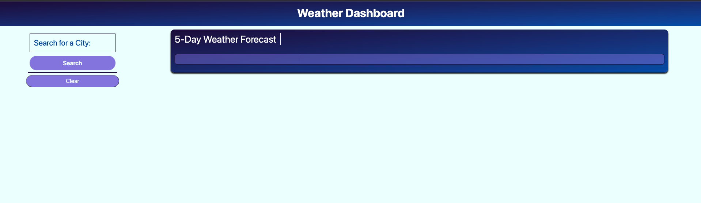

# Super Simple Weather

## Description

A nice and simple weather dashboard that presents you with basic information on the upcoming forecast of the searched city. The application allows you to search for multiple cities, while keeping the previous ones stored so you can go back with just a click of a button!

## Appearance

The following image shows the web application's appearance and functionality:

## Important Links
### GitHub Repository: https://github.com/kvs1995/super-simple-weather-dashboard/
### Deployed Application:  https://kvs1995.github.io/super-simple-weather-dashboard/
